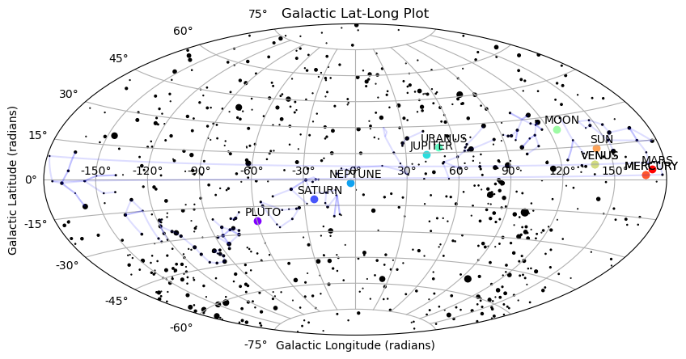

# Sky Observation Tool

A Python script for observing celestial bodies and plotting their positions using astronomical coordinates.

## Overview

The Sky Observation Tool is a Python script that utilizes the skyfield and matplot libraries to calculate and plot the positions of celestial bodies. It allows you to specify a date, time, and geographic location to observe the sky from and provides the altitude and azimuth values for various celestial objects.

## Features

- Calculate the altitude and azimuth of celestial bodies at a given date, time, and location
- Support for a wide range of celestial objects, including planets, stars, and the Moon
- Plot the positions of celestial objects on a polar coordinate system
- Customizable plot with labeled markers for each celestial object

## Prerequisites

- Python 3.x
- skyfield library (install via `pip install skyfield`)
- matplotlib library (install via `pip install matplotlib`)

## Usage

1. Install the required libraries by running the following command:

2. pip install skyfield matplotlib

3. Modify the script to specify your desired date, time, and geographic location.

4. Run the script using Python:

5. python sky_observation.py

6. The script will calculate the altitude and azimuth values for the specified celestial objects and plot them on a polar coordinate system.

## Example

Here's an example output of the script:

## Contributing

Contributions are welcome! If you have any ideas, suggestions, or bug reports, please open an issue or submit a pull request.

## License

This project is licensed under the MIT License. See the [LICENSE](LICENSE) file for more information.
Feel free to modify and customize the README.md file according to your specific project requirements.

## Acknowledgments
- The skyfield library: https://rhodesmill.org/skyfield/
- The matplotlib library: https://matplotlib.org/